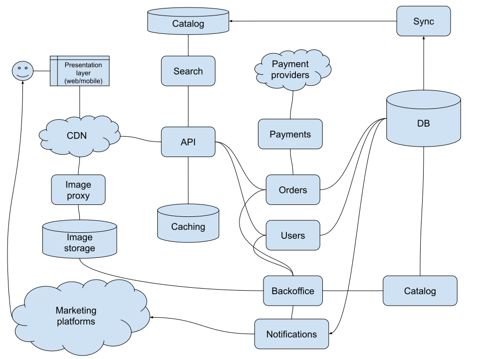

# Infrastructure repository
> for testing purposes

## Requirements

- [awsudo](https://github.com/makethunder/awsudo/blob/master/README.md): a tool to enforce 2FA when interacting with AWS
- docker: terraform is containerized to avoid having OS specific binaries installed and provide a predictable outcome
- AWS account, credentials and permissions to manage resources through terraform

## Structure

Code is organized into stages, aka environments. 
Each stage has its own account and properties (domain, subnets, regions, etc).


```
.
├── README.md
├── bin (for bin stubs and scripts)
│   └── terraform
├── lib (place to hold makefiles that can be used across the repo)
│   └── terraform.mk
├── modules (terraform modules)
│   ├── rds-cluster
│   ├── ...
│   └── redis
└── stages
    └── test 
        ├── bootstrap (required resources to start using terraform)
        │   ├── Makefile
        │   ├── dynamodb.tf
        │   ├── main.tf
        │   ├── provider.tf
        │   └── s3.tf
        ├── main (main state folder with resources for this stage)
        │   ├── Makefile
        │   ├── backend.tf
        │   ├── eks.tf
        │   ├── iam.tf
        │   ├── main.tf
        │   ├── provider.tf
        │   ├── rds.tf
        │   ├── redis.tf
        │   ├── route53.tf
        │   ├── s3.tf
        │   └── vpc.tf
        ├── outputs.tf (used as a source of values scoped to this stage)
        └── stage.mk (required values for make scoped to this stage)
```

## Getting started

Following best practices we will use an S3 bucket to store the state and dynamodb to provide a locking mechanism
when running terraform.

For the more frequent terraform commands we use `make` to simplify the process.

1. Adjust the account ID to be used in `stages/test/outputs.tf`
2. Adjust the AWS profile to be used in `stages/test/stage.mk`
3. Go to folder `stages/test/bootstrap`
4. Run `make plan` and confirm that the plan will create the following resources:
- aws_dynamodb_table.terraform_state_lock
- aws_s3_bucket.terraform_state_bucket

5. Run `make apply` to create those resources and allow us to persist the terraform state in S3
6. Go to the main folder `stages/test/main`
7. Same procedure. Here, a lot more resources will be created and it might take up to 20mins for it to finish.


## Overall architecture
> described in terraform

* Compute provided by kubernetes using EKS
* Transactional data would be stored in an Aurora mysql cluster that could also be configured for multimaster for increased write scalability
* Cached data would be served from a redis. In this case it's configured as an HA cluster to leverage a more agressive performant setup (cache would be used as first storage layer for most services with some sync service persisting the data into the relational db)
* Search could rely entirely on a document store such as elastic search. As the catalog changes a sync service would update ES or even reindex it fully if necessary
* As an alternative, postgresql can also be used as it provides decent full text search capabilites, with read replicas allowing for horizontal scaling
* S3 would be used to store images and maybe static assets such as frontend artifacts
* Cloudfront would be the caching layer for those images/assets although it would not access the images directly. An image proxy service (thumbor for example) would be dealing with requests that need some image manipulation (resizing for example)

## Not included

* Certificate and domain management
* WAF for increased security and endpoint protection and rate limiting
* Kubernetes manifests, CI/CD pipeline for platform services
* Queuing / Streaming resources for event driven architecture or simple service decoupling


## Architecture



## How to further scale

* Separate databases into different instances/clusters to spread load
* Prepare application/services to deal with different read and write endpoints for database in order to leverage read replicas for read only workloads
* If application is a monolith start by breaking away features that need to scale into smaller services
* For some non-critical intensive write workloads implement a caching first strategy (write to cache first and then async to database in background)
* Data sharding on database level could be last resort option since it's a bit more complex
